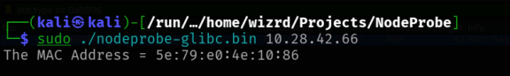
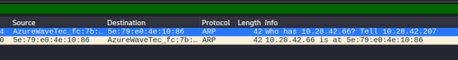
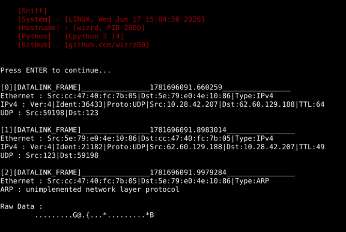
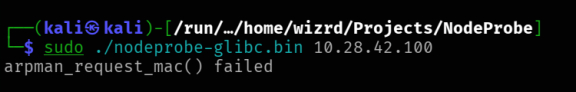
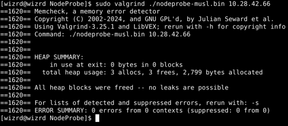
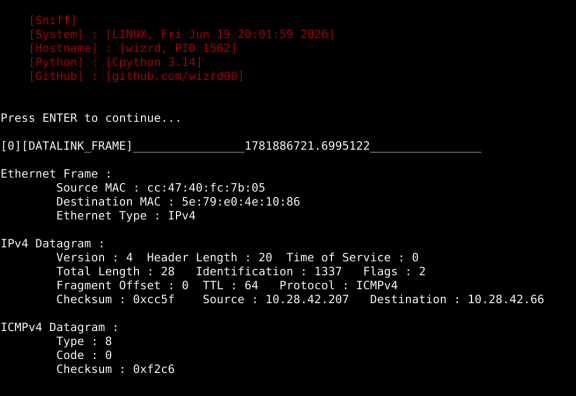
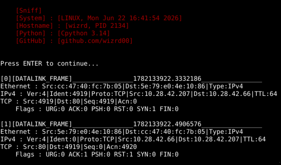
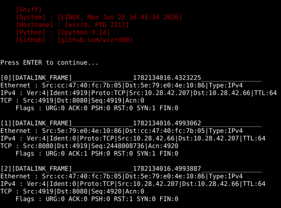
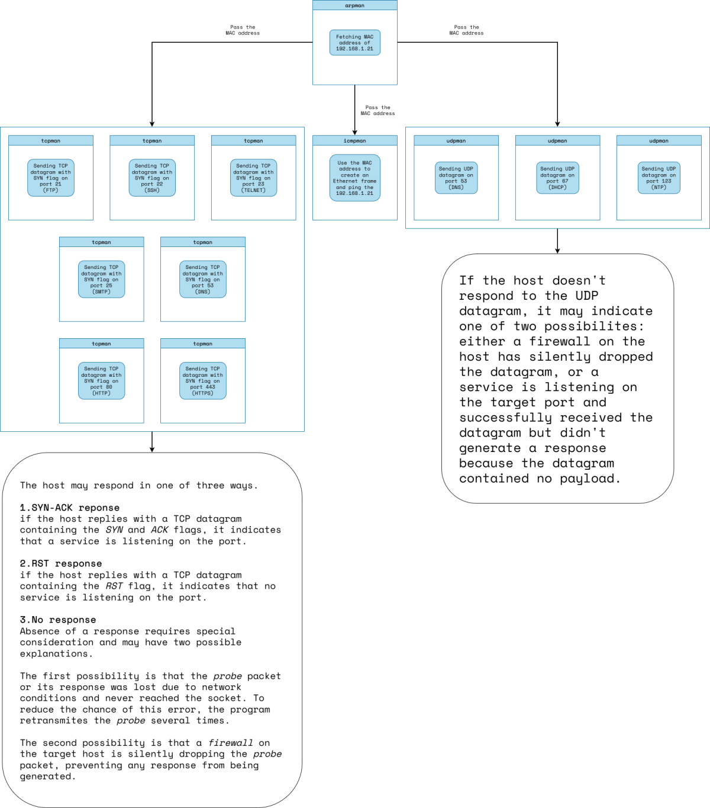

+++ 
draft = false
date = 2026-01-14
title = "NodeProbe"
description = "My Most Low-Level Network Project"
slug = "nodeprobe"
authors = ["Me"]
tags = ["network", "low-level", "linux", "arp", "ethernet", "c", "c99"]
categories = ["Projects"]
+++
# [NodeProbe](https://github.com/wizrd00/NodeProbe) Project 
NodeProbe is a multi-threaded network prober and host discovery which uses various *Network Protocols* to reconnaissance and gathering information about hosts in *Local Networks*.

### Logs
---

#### Steps
Steps to writing this program dispite of details :

- First step :
 - using ARP Req to discovery hosts and specifiy that an IP is alive or not.
To receive and send ARP, I need to create *dgram socket* with address family *AF_PACKET* but in protocol argument I have two options. First, set the protocol arg of `socket()` to `htons(ETH_P_ARP)` and start receiving and sending on socket. Second, set the protocol arg to zero and set the `sll_protocol` member of `struct sockaddr_ll` to `htons(ETH_P_ARP)`.

- Second step :
 - pinging the host to specifiying two things :  1.is host pingable or not.  2.average time to reach the host in *ms*.
To receive and send ICMP, I need to create *dgram socket* with address family *AF_INET* and set the protocol argument of `socket()` to *IPPROTO_ICMP*.

- Third step :
 - checking TCP-based services such as *SSH*, *FTP*, *HTTP* etc.

- Fourth step :
 - checking UDP-based services such as *DNS*, *DHCP, *NTP* etc.

#### How do I fake-test my modules?
Testing modules is an unavoidable part of programming and according to size of the project, there is two option in C :

- *assert.h* standard header and `assert()` macro; In small Projects it works fine but it has an annoying problem, it doesn't give u a location to where the problem occurs
- third-party test libraries like [*Unity*](https://github.com/ThrowTheSwitch/Unity)

I'm used to using *Unity* to test my modules. It's easy to link, It's minimal, It's fast(I think it probably tests units in saperate threads).
But in Network Projects, testing units is not that easy. because there is *IO Band* functions such as `recv()`, `send()`, `recvfrom()`, etc. So units can't be dependent on these functions and to reach that goal you have to write fake version of them and link them to ur software(linkers use your functions instead of *libc* version of them by default so there is no need to manipulate linker).

My method is to make a directory called *fake* inside of test dir and use *sed* to replace **`#include <sys/socket.h>`** to **`#include "fake_socket.h"`** or any header and save it in the *fake* dir. Also I write a *fake_socket.h* and *fake_socket.c* and use **`-Ifake`** make my compiler to use *fake_socket.h*.
To making all I have said sense, here is and example of this method :

```sh
test_arpman/
├── Makefile
├── build
├── fake
│   ├── fake_arpman.c
│   ├── fake_arpman.h
│   ├── fake_poll.c
│   ├── fake_poll.h
│   ├── fake_socket.c
│   └── fake_socket.h
└── test.c
```

and here is content of the [Makefile](https://github.com/wizrd00/NodeProbe/blob/main/test/test_arpman/Makefile) :

```makefile
CC = pcc
BUILD_DIR := build
FAKE_DIR := fake
INCLUDE_DIR := ../../include/
LIB_DIR := ../../library
UNITY_DIR := ../libunity
ifeq ($(CC), pcc)
CFLAGS := -std=c99 -O3 -Wc,-Werror=implicit-function-declaration,-Werror=missing-prototypes,-Werror=pointer-sign,-Werror=sign-compare,-Werror=strict-prototypes,-Werror=shadow -pthread
UNITY_LIB_FLAGS := -Wl,--library-path=$(LIB_DIR),--library=unity-musl,-rpath=$(LIB_DIR)
else ifeq ($(CC), gcc)
SPECIAL_OPTS := -DARPHRD_ETHER=1
CFLAGS := -std=gnu99 -O3 -Wall -Wextra -Wpedantic -Wstrict-aliasing -Wcast-align -Wconversion -Wsign-conversion -Wshadow -Wno-switch -pthread $(SPECIAL_OPTS)
UNITY_LIB_FLAGS := -L$(LIB_DIR) -lunity-glibc -Wl,-rpath=$(LIB_DIR)
else
$(error unsupported compiler : $(CC))
endif
TEST_SRC := test.c
TEST_OBJ := $(BUILD_DIR)/test.o
REAL_ARPMAN_SRC := ../../source/arpman.c
FAKE_ARPMAN_SRC := fake/fake_arpman.c
REAL_ARPMAN_HDR := ../../include/arpman.h
FAKE_ARPMAN_HDR := fake/fake_arpman.h
ARPMAN_OBJ := $(BUILD_DIR)/arpman.o
FAKE_SOCKET_SRC := fake/fake_socket.c
FAKE_SOCKET_OBJ := $(BUILD_DIR)/fake_socket.o
FAKE_POLL_SRC := fake/fake_poll.c
FAKE_POLL_OBJ := $(BUILD_DIR)/fake_poll.o
test.elf : $(ARPMAN_OBJ) $(FAKE_SOCKET_OBJ) $(FAKE_POLL_OBJ) $(TEST_OBJ)
	@echo linking object files $^
	$(CC) $(CFLAGS) -o $@ $^ $(UNITY_LIB_FLAGS)
$(TEST_OBJ) : $(TEST_SRC)
	@echo compiling $^
	$(CC) -c $(CFLAGS) -I$(FAKE_DIR) -I$(UNITY_DIR) -I$(INCLUDE_DIR) -o $@ $^
$(ARPMAN_OBJ) : $(FAKE_ARPMAN_SRC) $(FAKE_ARPMAN_HDR)
	@echo compiling $<
	$(CC) -c $(CFLAGS) -I$(FAKE_DIR) -I$(INCLUDE_DIR) -o $@ $<
$(FAKE_ARPMAN_SRC) : $(REAL_ARPMAN_SRC)
	@cp $< $@
$(FAKE_ARPMAN_HDR) : $(REAL_ARPMAN_HDR)
	@cp $< $@
	@sed -e "s/include <poll\.h>/include <fake_poll.h>/" -e "s/include <sys\/socket\.h>/include <fake_socket\.h>/" $< > $@
$(FAKE_SOCKET_OBJ) : $(FAKE_SOCKET_SRC)
	@echo compiling $<
	$(CC) -c $(CFLAGS) -I$(FAKE_DIR) -I$(INCLUDE_DIR) -o $@ $<
$(FAKE_POLL_OBJ) : $(FAKE_POLL_SRC)
	@echo compiling $<
	$(CC) -c $(CFLAGS) -I$(FAKE_DIR) -I$(INCLUDE_DIR) -o $@ $<
memcheck : test.elf
	@echo start checking test.elf for any memory bug
	valgrind --tool=memcheck --leak-check=full --show-leak-kinds=all ./$^
clean :
	rm -rf build/* test.elf
```

I don't enjoy this process but it's interesting.

#### Real Testing *arpman* Module
After fake testing the *arpman* module with fake `recvfrom()` and `poll()` functions, it's real testing turn.
In Network Projects *real testing* is neccessary and since I write my modules as independent as possible, the arpman can be use to translate an IP address to MAC address independently from the main Project and it's a standalone piece of software.

First test was about getting the *gateway*'s MAC, there is the result :





And also sniffing on the [HI6Toolkit](https://github.com/wizrd00/HI6ToolKit)



And now if I want to translate an IP which it's not allocated to any host, the result is this :



The `arpman_request_mac()` returns TIMEOUT when nobody response to its request.
This approach makes my program to be capable of detecting which host is alive which is not.

#### A Problem
After resolving MAC address using *arpman*, the program starts pinging the alive hosts(hosts that answered to ARP Request). But the problem is if I implement the *icmpman* module(which the program will use to ping) with `socket(AF_INET, SOCK_RAW, IPPROTO_ICMP)`, maybe the kernel didn't process the ARP reply for some reason and it tries to get target's MAC with ARP as same as my progam does in its first step with *arpman*; It means **using ARP twice just for one host**. My program knows the target's MAC but the kernel may not know. So in this case I rather to use `socket(AF_PACKET, SOCK_RAW, htons(ETH_P_IP))` instead to avoid unnecessary ARP REQ in kernel space.
Of course it'll make me to create even ethernet header in user space but it's a clever method in this situation.

#### Real Testing *icmpman* Module
Testing result of *icmpman* module :





#### Real Testing *tcpman* Module
In the first test the *tcpman* sends SYN segment to gateway(which is my phone) on port 80.
There is no service on port 80 in my phone, so there is the result :



In the second test the *tcpman* sends SYN segment on port 8080.
A http proxy is listening on this port in my phone, so there is the result :



So the *tcpman* works great :)

---
#### What now?
At this time(after implementing main modules : *arpman*, *icmpman*, *tcpman*, *udpman*) I don't know what should I do. should I implement *argman* or the *nodeprobe* or any other module. I think reviewing process of the nodeprobe to gather info from hosts should help. So what nodeprobe does?

##### 1.Discovering alive hosts in a *Local Network* with *arpman* module
But how this process should actually work? should discover **all hosts** first and then go to next step or should discover **one host** and go to next step and repeat this for each IP? or even discover hosts in **fixed-size** like 8 hosts and go to next step in **saperate threads**?
I think the last option makes more sense.

##### 2.Pinging the hosts that discovered from previous step using *icmpman* module

##### 3.Detemine what TCP service exists in the host

##### 4.Determine what UDP service exists in the host

So the process should something like this:



I think best way to use these modules is to use them as a *shared library* and let *interface*s decide.
So after modifying *logman* module and add a *mutex* to its main context struct, and making it *Thread-Safe* I've decided to develope my own Interface for NodeProbe and it's been called *NodeProbe-GUI*.
