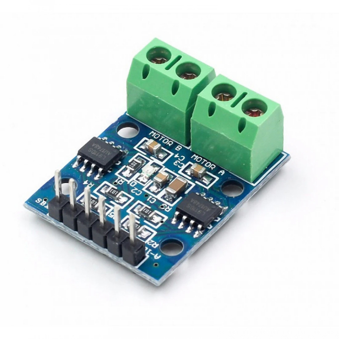
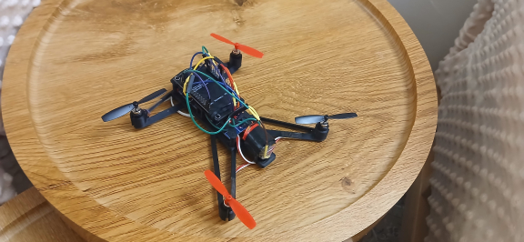
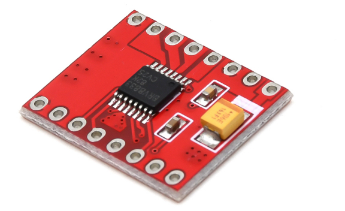
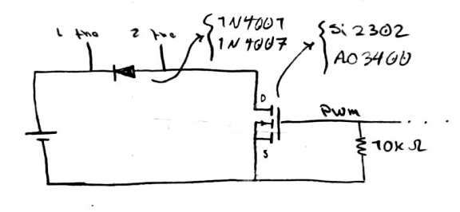
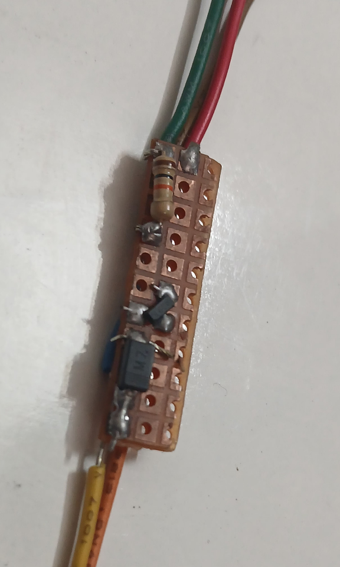
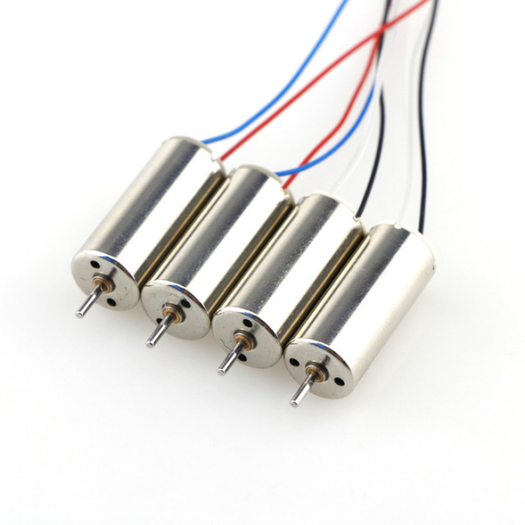
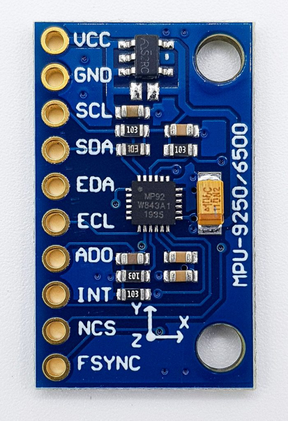

+++ 
draft = true
date = 2026-08-17T09:04:22-04:00
title = "Raven"
description = "My Research Around Building a QuadCoopter"
authors = []
tags = []
categories = []
externalLink = ""
series = []
+++
# [Raven](https://github.com/wizrd00/raven) Project 
This project is a quadcopter called raven. actually this project hasn't done yet though.
I've started it few weeks ago and I stoped that becasuse of my final tests at [IKIU](https://en.wikipedia.org/wiki/Imam_Khomeini_International_University).
Let me start from the begining.
I've got an idea to make a quadcopter with dc motor driver(I'd already done enough projects with [ESP8266](https://en.wikipedia.org/wiki/ESP8266) NodeMCU module) so I searched around dc driver motors,
there was **L298** driver (which it wasn't appropriate for a quadcopter because it's old, large and it uses old non-smd *MOSFET* which makes it hot after a while), **L9110S** driver(which I bought at first time), **TB6612FNG** driver(too expensive) etc.
I didn't have any exprience about coreless motors and how much *current* they need so I bought two L9110S.

The L9110S driver is a two-channel, H-bridge DC motor driver and each channel maximum current is **800mA**! and I've said before, I didn't know a coreless motor in it's maximum speed with a reasonable *propeller* may needs 1.8A so L9110S was a bad mistake.
Altought I knew it's not gonna work but I assembled it just for fun to see what happen and the result was this

This quadcopter(it's not even close to be a quadcopter) had several issues :

- it was too heavy, two L9110S driver with a NodeMCU module and the battery(a *Pod Vape* Li-ion 600mA 8A battery) which was heaviest item.
- fake battery, a quadcopter needs *Li-pol* battery which is light and also it needs a battery with high discharge coefficient.
- inappropriate motor driver
- bad wiring, the picture above clearly shows that the wiring is a mess.
- weak motors, I've got four 720 coreless motors which was obviously too weak but I hadn't realize that.

So I've researched to find a better motor driver and after lots of searching and scrolling I found *DRV8833* motor driver, it gave me a lot of hope.

The DRV8833 driver basically works like L9110S(much smaller than L9110S and also with *AT8833* IC) but with a important difference, the DRV8833 provides 2A peak per channel and provides 1.2A continuously per channel.
Therefore, I bought two of them.

To solve the battery issue I bought a Li-pol 600mA 25C quadcopter battery which it was so light.

I wasn't going to believe the fact that my coreless motors are weak and it should be the first thing to replace and I assembled the quadcopter again and this time motors were working at highest speed(because I'd set PWM *duty cycle* to 100%) but still the quadcopter couldn't fly and after a while working in maximum speed, the flying wasn't the main problem the drivers were.
Yes, the drivers were close be burnt and in that moment I realized an appropriate driver must provide at least 1A more than the current each motor needs to work in maximum speed.

But this time there wasn't the driver I need so I had to make my own DC motor driver.
I knew first thing that a motor driver needs is a *MOSFET* but I didn't know other stuff a driver needs.
So I've searched alot and I finally realized what a motor driver needs(in this case I didn't need H-brigde) :
- High current SMD MOSFET
- Pull down Resistor, to discharge the MOSFET gate.
- SMD Diode, as a flyback diode.

So, I designed this scheme

And after buying *AO3400* MOSFET SOT23 package, *M7* Diode and 10K Resistor I made four of this :

The only problem right now is the motors and I'm gonna buy 8520 Coreless after my final tests.

If the quadcopter flies, it gonna need Accelerometer/Gyroscope sensor like *MPU6050* or *MPU9250*.

