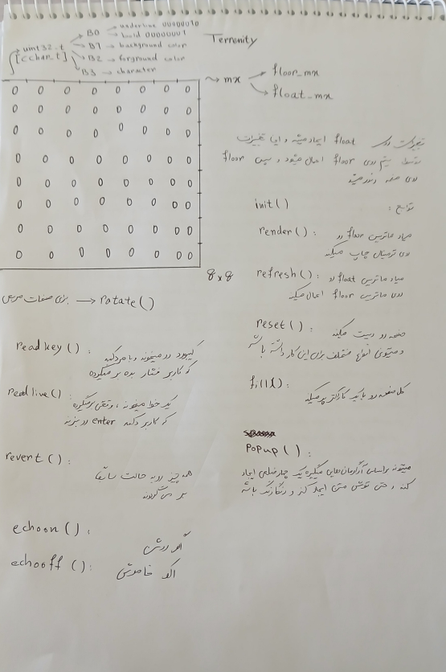
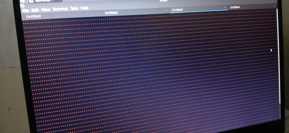
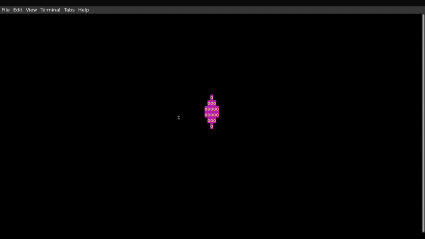
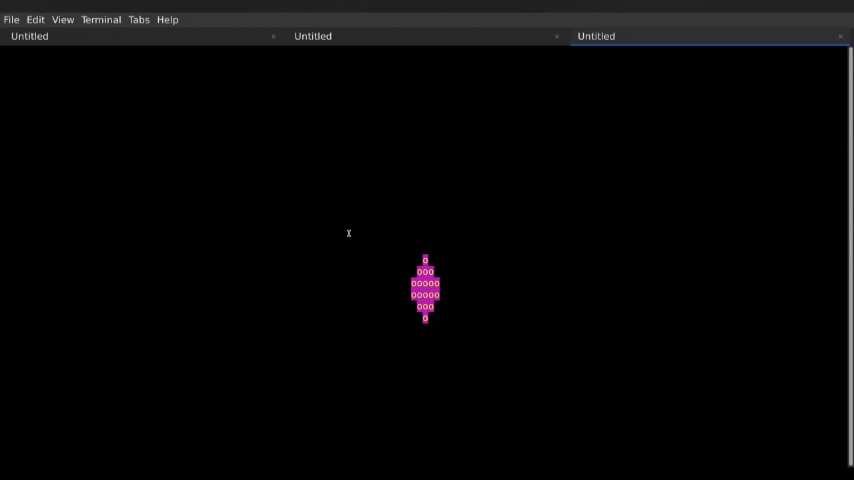
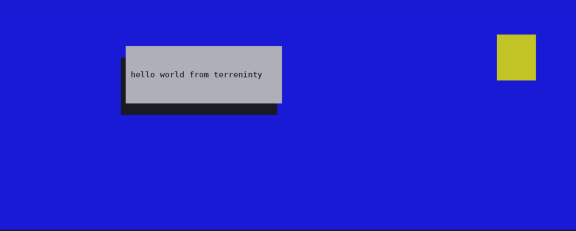

+++ 
draft = true
date = 2026-08-17T09:11:32-04:00
title = "Terrenity"
description = "Professional Terminal Graphics Engine based on termios(UNIX API)"
authors = []
tags = []
categories = []
externalLink = ""
series = []
+++
# [Terrenity](https://github.com/wizrd00/terrenity) Project 
The terrenity work is combination of three word *terminal*, *render* and *simplicity*.
I wrote this library because I had an idea : *What if we consider each terminal character cell as a pixel?*.
If we consider each terminal character cell as pixel, we have a matrix-display instead of terminal which with specific command we can clear the screen, change color of a pixel and other adjustments exactly like a real display like ssd1306 display module.

### First Scheme



The main core of terrenity consists of two matrixes : `floor_mx` and `float_mx`.
The `floor_mx` is the last buffer before rendering and whatever is in this matrix is gonna write on the *stdout*.
Each item of these matrixes is a `pixel_t` structure as below :

```C
typedef struct {
	uint8_t ulbd;
	uint8_t bgnd;
	uint8_t fgnd;
	uint8_t cval;
} pixel_t;
```

if `ulbd` value equals to 4, enables *underline* for character in the pixel and value 1 enables *bold*.
`bgnd` is for *background color* and `fgnd` is for *foreground color*.
The `cval` is for `char` value.
All supported colors has been defined in this [header](https://github.com/wizrd00/terrenity/blob/main/include/ansi_color.h).

So, based on the schematic, I started to write the functions; the `mx_fill()` function was one of them that fills entire screen with just one `pixel_t` and the picture below is the first time I have tested it.



And if I'm being honest, it felt great.

### First Moving Object
After completing basic tests to test functions, I started to write more complicated tests such as moving a shape on the screen.
The result was this :



Moving shape worked fine but there was a huge issue : **flicker**.
The problem appeared in `mx_render()` function and specially in `render_matrix()` *static* function.
The Problem was obvious, I was using the `write()` *syscall* for each pixel in `floor_mx` matrix which means to render single *frame* in a 24\*96 terminal, the library was calling the `write()` 2304 times which means for a 24fps game the library would call `write()` 55296 times.
This is **extremely inefficient**, therefore, I decided to use a *buffer* to copy entire `floor_mx` in it and use only one `write()` syscall to write the whole buffer into the *stdout*.
The result was this :



The flicker faded just because of using `row * col` bytes more of the *memory* which shows importance of the memory to *programmers*.

### Shadowed Message Box
Creating Message Boxes with shadow was my next test.
The result was this :



### New Ideas
- [ ] Add `draw_circle()` function, the library already have functions to draw *rectangle* and *rhombus* but circle is the next step. My idea to draw a circle based on the circle equation which is x^2^ + y^2^ = R^2^.
- [ ] Add `draw_message_box()` function.
- [ ] Extend the terrenity to *3D Rendering*.

### Last Words
Working on this library was one of my best times and its code is one of the cleanest and most carefully code I've ever written.
Also I have to complete its documentation which is exhausting :(
